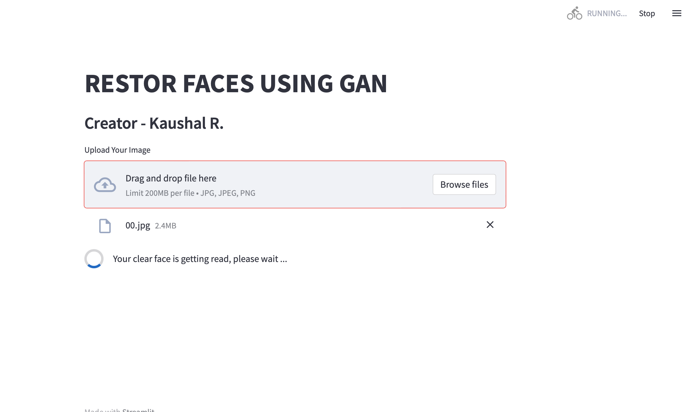
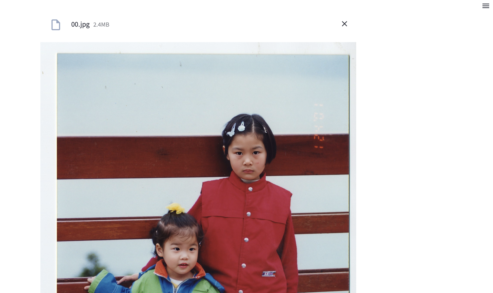

# Streamlit application to restore old images
Using a generative model, we can restore the old 90's photographs to higher quality

### Install using conda
```python
conda install -n gfgan -f environment.yml
conda activate gfgan
```

### Model file
```
https://drive.google.com/file/d/124aNK-sATUxOBDhILfilmT36k2uj_Wty/view
```

### How to use
After installation below steps will help to run app on webpage

Open the terminal and fire below command
```
streamlit run wrapper.py
```

### Web Application 
Click on browse image and setect the image you want to restore

# Results


